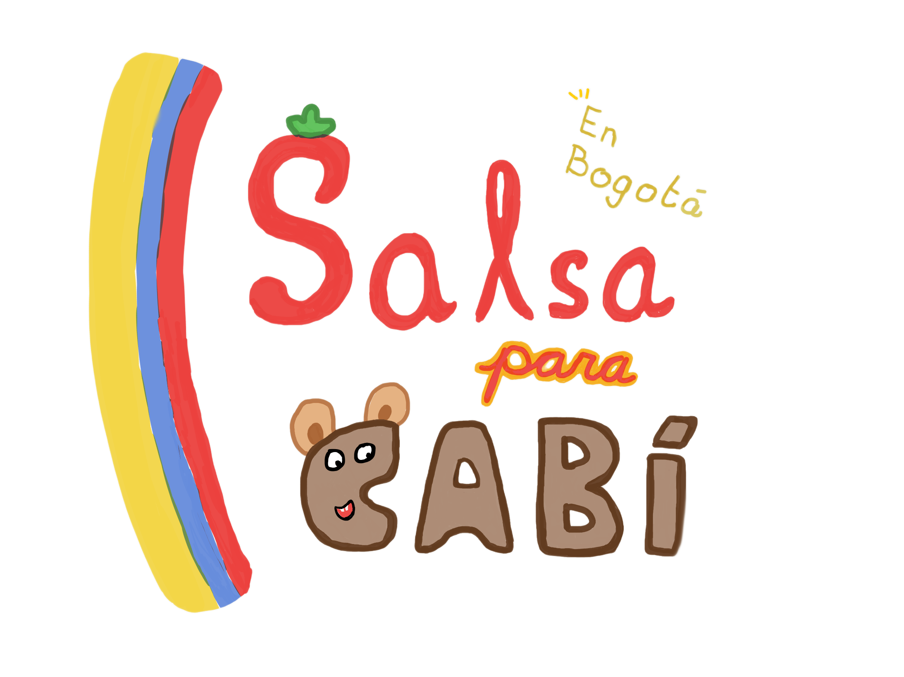

A desktop game where you dance salsa in front of your webcam, and computer vision judges your moves!

Real-time pose estimation (YOLO) feeds a LSTM move classifier that recognizes your dance moves (`basic_move`, `idle`, `side_step`, `spin`) live from webcam video. Land the moves the game calls for and earn your salsa license from Señorita Cabí and Señor Empanada, up on the slopes of Monserrate, Bogotá.
## How it works


- **`backend/`** — Python/FastAPI service. Captures webcam frames, runs YOLO pose estimation to extract keypoints, and feeds a rolling window of them into a trained LSTM classifier. Serves the latest pose + move prediction over REST (`/api/pose`, `/api/prediction`, `/api/state`) and a live WebSocket (`/ws/state`) that pushes updates the moment a new result is ready.
- **`frontend/`** — React + Vite app, packaged as an Electron desktop app. Renders the story, the dance game, and the leaderboard, and polls/subscribes to the backend for pose data to drive gameplay.
- **`supabase/`** — Postgres schema for the online leaderboard (`salsa_leaderboard` table + `submit_score` RPC, one best score per player).
- **`yolo26n-pose.pt`** — pretrained YOLO pose model used for keypoint extraction.

### Training data / model

- Dance clips are recorded per-move with `backend/dataset_recorder.py` into `backend/dataset/<move_name>/`.
- `backend/train_lstm.py` trains the LSTM classifier on that dataset and writes a checkpoint to `backend/model/lstm_move_classifier.pt`.
- `backend/test_lstm_model.py` opens a live webcam window with prediction bars.

## Getting started

### Prerequisites

- Python 3.10+ and a virtualenv at `.venv/` in the repo root (Electron looks for it first before falling back to `python` on `PATH`)
- Node.js + npm
- A webcam
- A [Supabase](https://supabase.com) project (for the leaderboard)

### Backend setup

```bash
python -m venv .venv
source .venv/bin/activate    # Windows: .venv\Scripts\activate
pip install -r requirements.txt
```

Run the API standalone (auto-reload, for development):

```bash
cd backend
uvicorn api:app --reload --port 8000
```

### Frontend setup

```bash
cd frontend
npm install
cp ../.env.sample .env   # fill in your Supabase URL + publishable key
```

Run everything together as the Electron app (starts the Python backend automatically and opens the game window):

```bash
npm run electron:dev
```

Or just the web frontend against an already-running backend:

```bash
npm run dev
```

### Environment variables

Copy [`.env.sample`](.env.sample) to `.env` and fill in your own Supabase project credentials:

```
VITE_SUPABASE_URL=https://your-project.supabase.co
VITE_SUPABASE_PUBLISHABLE_KEY=sb_publishable_...
```

Apply [`supabase/schema.sql`](supabase/schema.sql) to your Supabase project to set up the leaderboard table and RPC.

## Repo layout

```
backend/
  api.py               # FastAPI app: pose pipeline + REST/WebSocket endpoints
  pose_utils.py         # YOLO pose loading, inference, keypoint extraction
  lstm_model.py          # LSTM architecture + feature/augmentation helpers
  inference.py            # shared checkpoint loading + prediction
  train_lstm.py            # trains the move classifier from recorded clips
  dataset_recorder.py       # webcam tool for recording labeled move clips
  test_lstm_model.py         # live webcam sanity check for a trained model
  dataset/                    # recorded per-move training clips
  model/                        # trained checkpoint(s)
frontend/
  src/                  # React app (game, story/cutscenes, leaderboard)
  electron/              # Electron main/preload — launches backend + window
  public/                  # art, video, and music assets
supabase/
  schema.sql             # leaderboard table + submit_score RPC
```

## Acknowledgments

Thank u so much to Tati for teaching us salsa and farming data, and to Dhamari for farming data. Me yum data 🫓
